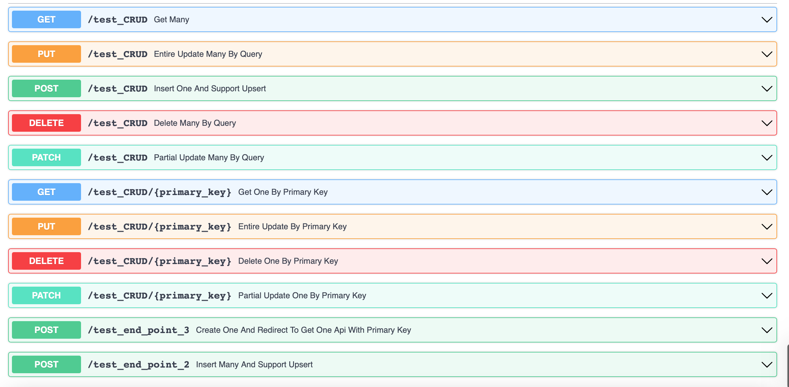
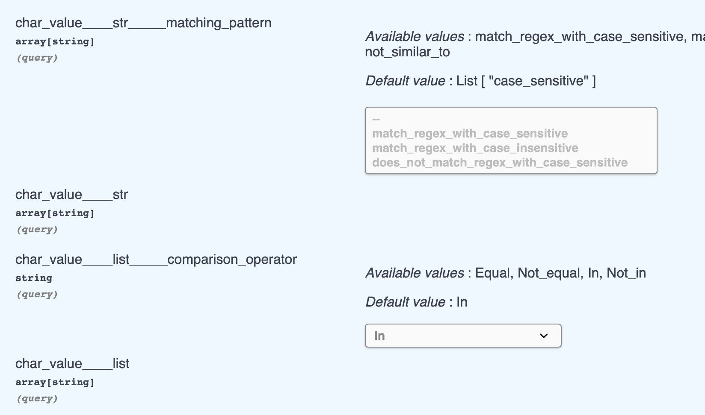
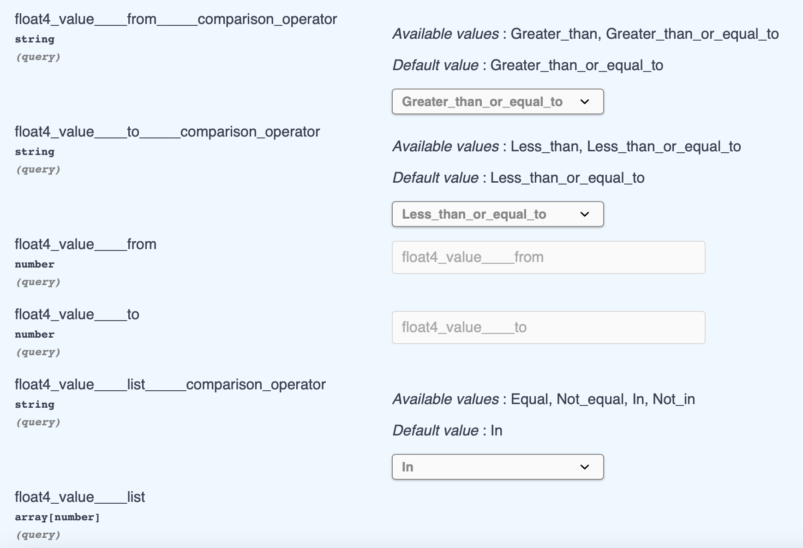
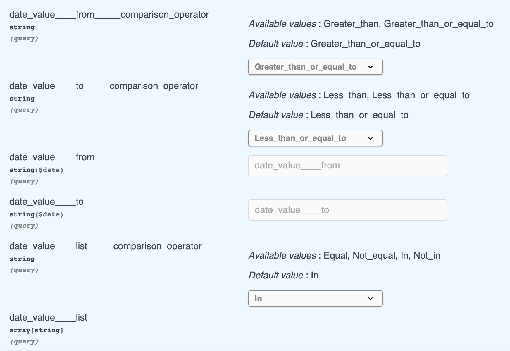
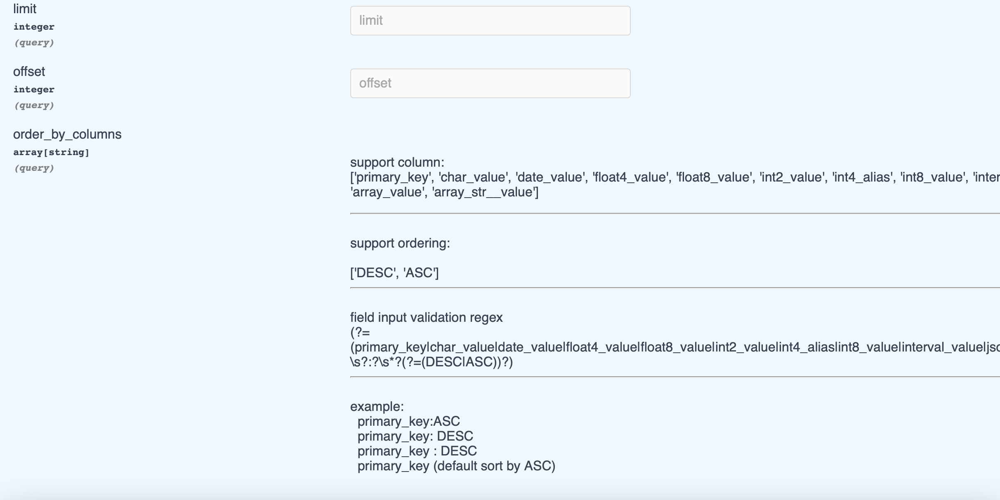

#  FastAPI Quick CRUD

This is a CRUD router builder, which allow you to build Pydantic model automatically via SQLAlchemy schema, and provided that a simple but comprehensive CRUD API:


- Get one
- Get many
- Update one
- Update many
- Patch one
- Patch many
- Create/Upsert one
- Create/Upsert many
- Delete One
- Delete Many
- Post Redirect Get




- Query Operation will look like that when python type of column is 
  - string
    - support Approximate String Matching that require this 
        - (<column_name>____str, <column_name>____str_____matching_pattern)
    - support In-place Operation, get the value of column in the list of input
        - (<column_name>____list, <column_name>____list____comparison_operator)
    

  - numeric 
    - support Range Searching from and to
        - (<column_name>____from, <column_name>____from_____comparison_operator)
        - (<column_name>____to, <column_name>____to_____comparison_operator)
    - support In-place Operation, get the value of column in the list of input
        - (<column_name>____list, <column_name>____list____comparison_operator)
    

  - datetime 
    - support Range Searching from and to
        - (<column_name>____from, <column_name>____from_____comparison_operator)
        - (<column_name>____to, <column_name>____to_____comparison_operator)
    - support In-place Operation, get the value of column in the list of input
        - (<column_name>____list, <column_name>____list____comparison_operator)
    

  - Pagination 
    - limit
    - offset
    - order by
    
  
      
- Approximate String Matching  
    ref: https://www.postgresql.org/docs/9.3/functions-matching.html
    - example:
      
        if query is
      
        ```text
      /test_CRUD?
      char_value____str_____matching_pattern=match_regex_with_case_sensitive&
      char_value____str_____matching_pattern=does_not_match_regex_with_case_insensitive&
      char_value____str_____matching_pattern=case_sensitive&
      char_value____str_____matching_pattern=not_case_insensitive&
      char_value____str=a&
      char_value____str=b
      ```
      
    - the sql will look like that
        ```sql
        SELECT *
        FROM untitled_table_256 
        WHERE (untitled_table_256.char_value ~ 'a') OR 
        (untitled_table_256.char_value ~ 'b' OR 
        (untitled_table_256.char_value !~* 'a') OR 
        (untitled_table_256.char_value !~* 'b' OR 
        untitled_table_256.char_value LIKE 'a' OR 
        untitled_table_256.char_value LIKE 'b' OR 
        untitled_table_256.char_value NOT ILIKE 'a' 
        OR untitled_table_256.char_value NOT ILIKE 'b'
        ```
      
- In-place Operation
    - In-place support the following operation
    
  
    - query example
      - if user select Equal operation and input True and False
```sql        
        select * FROM untitled_table_256 
        WHERE untitled_table_256.bool_value = true OR 
        untitled_table_256.bool_value = false
```     
        
- Range Searching
    - Range Searching support the following operation
    
  
    
  
  - sql is look like that
    ```sql
    select * from untitled_table_256
    WHERE untitled_table_256.date_value > %(date_value_1)s 
    ```
    ```sql
    select * from untitled_table_256
    WHERE untitled_table_256.date_value < %(date_value_1)s 
    ```

Also support your custom dependency for each api


## Quick Use
```commandline
pip install quick-crud
```
1. Build a sample table with Sqlalchemy

    Strongly recommend you use [sqlacodegen](https://pypi.org/project/sqlacodegen/) to  generate the sql schema

    ```python
    from sqlalchemy import create_engine
    from sqlalchemy import *
    from sqlalchemy.dialects.postgresql import *
    from sqlalchemy.orm import *
   
    Base = declarative_base()
    metadata = Base.metadata
    engine = create_engine('postgresql://<user name>:<password>@<host>:<port>/<database name>', 
                            future=True, 
                            echo=True,
                            pool_use_lifo=True,
                            pool_pre_ping=True, 
                            pool_recycle=7200)

    class CRUDTest(Base):
        __tablename__ = 'crud_test'
        __table_args__ = (
            UniqueConstraint('id','float4_value', 'int4_value'),
        )

        id = Column(Integer, primary_key=True, server_default=text("nextval('untitled_table_256_id_seq'::regclass)"))
        bool_value = Column(Boolean, nullable=False, server_default=text("false"))
        bytea_value = Column(LargeBinary)
        char_value = Column(CHAR(10))
        date_value = Column(Date, server_default=text("now()"))
        float4_value = Column(Float, nullable=False)
        float8_value = Column(Float(53), nullable=False, server_default=text("10.10"))
        int2_value = Column(SmallInteger, nullable=False)
        int4_value = Column(Integer, nullable=False)
        int8_value = Column(BigInteger, default=99)
        interval_value = Column(INTERVAL)
        json_value = Column(JSON)
        jsonb_value = Column(JSONB(astext_type=Text()))
        numeric_value = Column(Numeric)
        text_value = Column(Text)
        time_value = Column(Time)
        timestamp_value = Column(DateTime)
        timestamptz_value = Column(DateTime(True))
        timetz_value = Column(Time(True))
        uuid_value = Column(UUID(as_uuid=True))
        varchar_value = Column(String)
        array_value = Column(ARRAY(Integer()))
        array_str__value = Column(ARRAY(String()))

    CRUDTest.__table__.create(engine)
    ```

2. prepare a database connection 

    ```python
    session = sessionmaker(autocommit=False, autoflush=False, bind=engine)
    def get_transaction_session():
        try:
            db = session()
            yield db
        finally:
            db.close()
    ```

3. import the required module

    ```python
    from fastapi_quickcrud import crud_router
    from fastapi_quickcrud import CrudService
    from fastapi_quickcrud import CrudMethods
    from fastapi_quickcrud import sqlalchemy_to_pydantic
    ```

4. register CrudService  

    ```python
    test_crud_service = CrudService(model=CRUDTest)
    ```

5. convert the sqlalchemy model to Pydantic model

    ```python
    test_crud_model = sqlalchemy_to_pydantic(db_model = CRUDTest,
                                             crud_methods=[
                                                       CrudMethods.FIND_MANY,
                                                       CrudMethods.FIND_ONE,
                                                       CrudMethods.UPSERT_ONE,
                                                       CrudMethods.UPDATE_MANY,
                                                       CrudMethods.UPDATE_ONE,
                                                       CrudMethods.DELETE_ONE,
                                                       CrudMethods.DELETE_MANY,
                                                       CrudMethods.PATCH_MANY,
                                                       CrudMethods.PATCH_ONE,

                                               ],
                                             exclude_columns=[])

    ```

    - argument:
        - db_model: ```Sqlachemy Declarative Base Class```
        - crud_methods: ```CrudMethods```
            - examples
              - CrudMethods.FIND_ONE
              - CrudMethods.FIND_MANY
              - CrudMethods.UPDATE_ONE
              - CrudMethods.UPDATE_MANY
              - CrudMethods.PATCH_ONE
              - CrudMethods.PATCH_MANY
              - CrudMethods.UPSERT_ONE
              - CrudMethods.UPSERT_MANY
              - CrudMethods.DELETE_ONE
              - CrudMethods.DELETE_MANY
              - CrudMethods.POST_REDIRECT_GET

        - exclude_columns: set the columns that not to be operated but the columns should nullable or set the default value)

6. user CrudRouter to register API

    - db_session: `get_transaction_session`

    - crud_service: `CrudService`

    - crud_models: `sqlalchemy_to_pydantic` 

    - prefix, tags: extra argument for include_router() of APIRouter() of fastapi

    ```python
    	new_route_3 = crud_router(db_session=get_transaction_session,
                                  crud_service=UntitledTable256_service,
                                  crud_models=test_crud_model,
                                  prefix="/crud_test",
                                  dependencies = [],
                                  tags=["Example"]
                                  )
    ```


# constraint

- Please use composite unique constraint if there are more than one unique fields
- Please don't use composite unique constraint and the single unique constraint at the same time
    - except the single one unique constraint is primary key which be contained into composite unique constraint
        ```python
        class Example(Base):
            __tablename__ = 'example'
            __table_args__ = (
                UniqueConstraint('p_id', 'test'),
            )
        
            p_id = Column(Integer, primary_key=True, unique=True)
            test = Column(Integer)
            test_1 = Column(Text)

        ```

- Primary key is required but not support composite primary key
- The field of api will be optional if there is default value or is nullable or server_default is set
- The value of server_default did not support show on OpenAPI
- The field of api will be required if there is no default value of the column or is not nullable
- Some type of columns are not support in query:
    - INTERVAL
    - JSON
    - JSONB
    - H-STORE
    - ARRAY
    - BYTE
    - Geography
    - box
    - line
    - point
    - lseg
    - polygon
    - inet
    - macaddr

- Automap() of Sqlalchemy is not support


# Alias

Alias is supported already

usage:

```python
id = Column('primary_key',Integer, primary_key=True, server_default=text("nextval('untitled_table_256_id_seq'::regclass)"))
```

you can use info argument to set the alias name of column, 
and use synonym to map the column between alias column and original column

```python
id = Column(Integer, info={'alias_name': 'primary_key'}, primary_key=True, server_default=text("nextval('untitled_table_256_id_seq'::regclass)"))
primary_key = synonym('id')
```
